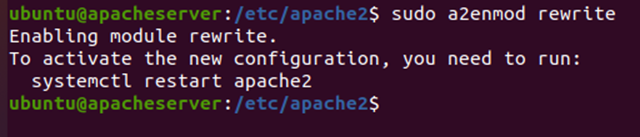
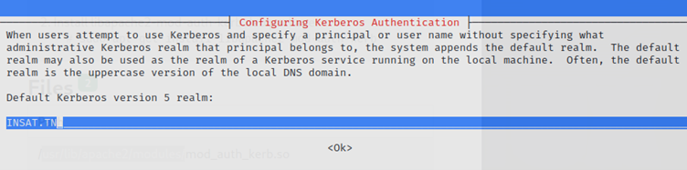
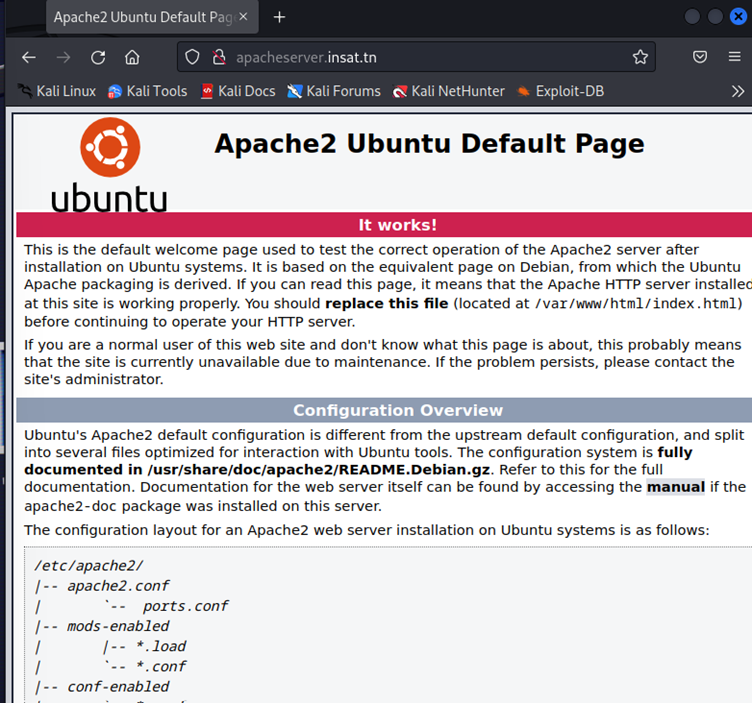
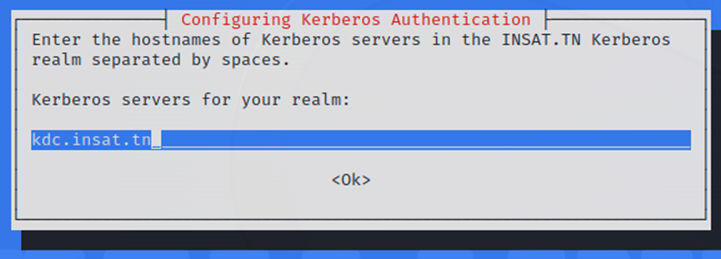

# Kerberos-Authentification-with-Apache

## What is Kerberos ?

* **Kerberos** is a computer network authentication protocol, which provides a secure Single Sign On (SSO) based on a trusted third-party mutual authentication service. It is secure because the user’s password is never transmitted over the wire. **Kerberos** uses Tickets which are negotiated with the server, with a limited time to live.
* In the case of HTTP, support for Kerberos is usually provided using the **SPNEGO authentication mechanism** (Simple and Protected GSS-API Negotiation). This is also known as **‘integrated authentication’** or **‘negotiate authentication’**.
* **Apache** does not itself support SPNEGO, but support can be added by means of the `mod_auth_kerb` authentication module.

## Configurations

### Hostname and IP Addresses
in this manipulation we will use 3 kali machines : <br/>
* **KDC machine** : `192.168.232.3`
* **Apache server machine** : `192.168.232.6`
* **Client machine** : `192.168.232.5`
> Virtual machines only have a **NAT adapter** by default but we will have to assign IP addresses to these machines, In order to do that we have to add a **host-only adapter** to each machine manually 
 <p align="center"></p>

### Synchronisation des horloges
Kerberos nécessite une synchronisation de horloges entre les 3 machines. Donc les horloges des 3 machines doivent être synchronisées.

System clock synchronized était initialisée à false.  Pour l’activer : 
  ```Shell
  sudo apt install systemd-timesyncd
   ```
 <p align="center"></p>
 
   ```Shell
  sudo systemctl start systemd-timesyncd
   ```
   ```Shell
  sudo systemctl set-nyp true
   ```
 <p align="center"></p>
On aura alors dans les 3 machines : <br/>
<table>
  <tr>
    <th>KDC</th>
    <th>Client</th>
    <th>Service</th>
  </tr>
  <tr>
    <td></td>
    <td></td>
    <td></td>
  </tr>
</table>

Définissons **des noms d'hôtes** pour chaque machine:<br/>
<table>
  <tr>
    <th>Machine KDC</th>
    <th>Machine Client</th>
    <th>Machine Apache Server</th>
  </tr>
  <tr>
    <td></td>
    <td></td>
    <td></td>
  </tr>
</table>


> NB: pour vérifier le nom d'hôte de chaque machine on utilise la commande : `hostname`  

Ensuite on mappe chaque nom d'hôte avec son **IP address** sur chaque machine . On accède alors au fichier au fichier `/etc/hosts` et on ajoute ces lignes. <br/>
   ```Shell
  sudo nano /etc/hosts
   ```
 <p align="center"></p>
 <p align="center"></p>

Une fois la configuration terminée, nous pouvons vérifier si les 3 machines sont accessibles grâce à la commande `ping` :

<table>
  <tr>
    <th>Machine KDC</th>
    <th>Machine Client</th>
    <th>Machine Apache Server</th>
  </tr>
  <tr>
    <td></td>
    <td></td>
    <td></td>
  </tr>
</table>	

###	Configuration des machines:
#### Centre de Distribution des Clés (KDC): dans la machine KDC
* on installe les packages à installer sur la machine KDC: <br/>
   
   ```Shell
  sudo apt update
   ```
 <p align="center"></p>

   ```Shell
  sudo apt install krb5-kdc krb5-admin-server krb5-config
   ```
<p align="center"></p>
 
 
Lors de l’installation , on doit configurer **Kerberos** comme suit 

* **Le realm** : `INSAT.TN` (doit être écrit tout en majuscules)
* **Le serveur Kerberos** : `kdc.insat.tn`
* **Le serveur administrateur du royaume** : `kdc.insat.tn`

> **Le realm de Kerberos** est un terme utilisé dans le système d'authentification Kerberos. Il s'agit d'une chaîne de caractères qui identifie un domaine administratif unique pour l'ensemble des serveurs et des clients qui utilisent Kerberos pour l'authentification et l'autorisation.

* puis on exécute la commande : 
   ```Shell
  sudo kerb5_newrealm
   ```
<p align="center"></p>

Elle nous demande alors d’entrer le `KDC dataset master key`

> NB : 
> * La commande `sudo krb5_newrealm` est utilisée pour créer un nouveau royaume Kerberos sur un serveur. Cette commande est généralement utilisée par les administrateurs système qui mettent en place un nouvel environnement Kerberos.
> * Lorsque vous exécutez la commande `sudo krb5_newrealm` , elle vous invite à entrer plusieurs options de configuration, telles que le nom de royaume, le nom du serveur d'administration Kerberos et le royaume Kerberos par défaut pour les clients qui ne font pas partie du nouveau royaume. Une fois que vous avez saisi toutes les informations requises, la commande crée un nouveau royaume Kerberos et initialise la base de données Kerberos.

* **Création des utilisateurs :**
Les utilisateurs et les services d’un domaine sont définis comme des principals dans Kerberos . Ils sont gérés par un utilisateur admin que nous devons créer manuellement : 
   ```Shell
  sudo kadmin.local
   ```
	 <p align="center"></p>
	 
> NB : `kadmin.local` est un utilitaire d'administration local pour Kerberos qui permet de gérer les principaux d'une base de données Kerberos à partir d'une ligne de commande.

* Pour vérifier la liste des principals:
   ```Shell
  list_principals
   ```
 <p align="center"></p>

* Ensuite, nous devons accorder tous les droits d’accès à la base de données Kerberos à admin principal `root / admin` en utilisant le fichier de configuration `/etc/krb5kdc/kadm5.acl` .
   ```Shell
  sudo nano /etc/krb5kdc/kadm5.acl
   ```
<p align="center"></p>
 <p align="center"></p>
 
* Pour que les modifications prennent effet, nous devons redémarrer le service suivant: 
   ```Shell
  sudo service krb5-admin-server restart
   ```
  <p align="center"></p>

* Maintenant on va créer des principaux pour **la machine cliente** et **la machine apacheserver** 

<table align="center">
  <tr>
    <th>Le principal pour le client</th>
  </tr>
  <tr>
    <td></td>
  </tr>
  <tr>
    <th>Le principal su server Apache</th>
  </tr>
  <tr>
    <td></td>
  </tr>
</table>

* pour vérifier la nouvelles liste des principaux :
  <p align="center"></p>

#### Le serveur Apache : 
* on installe `apache2` :
   ``` Shell
  sudo apt update -y
   ```
   <p align="center"></p>
   
  ``` Shell
  sudo apt install apache2 -y
  ```
    <p align="center"></p>

* pour vérifier que Apache2 est déjà démarré :

  ``` Shell
  sudo systemctl status apache2.service
  ```
  
  <p align="center"></p>

* pour que notre serveur démarre automatiquement au démarrage de la machine , on doit exécuter la commande:

  ``` Shell
  sudo systemctl enable apache2
  ```
  
  <p align="center"></p>

* Après l’installation il est recommandé d’installer `curl` , si on veut pouvoir lancer les cnxs web depuis le navigateur:
  ``` Shell
  sudo apt install curl
  ```
  <p align="center"></p>

* Les fichiers et dossiers nécessaires à la configuration des sites webs au travers des hôtes virtuels sont dans `/etc/apache2` . ceux nous intéressant sont:

 ``` Shell
   .
   │  ...
   ├── etc
   │   └── apache2
   │       ├── apache2.conf    # fichier contenant la configurations par defauts d'apache
   │       ├── conf-available  # dossier contenant les configurations disponibles dans apache
   │       ├── conf-enabled    # dossier contenant les configurations actives dans apache
   │       ├── mods-available  # dossier contenant les modules prient en charges par apache
   │       └── sites-available # dossier contenant les fichiers de configuration des sites web
   │  ...
  
  ```

> NB:
> * Apache lit les fichier de configuration pas ordre numérique de `000` à `XXX`.
> <p align="center"></p>
> * Le dossier sites-enabled : (contenant les fichiers des sites actif sur le serveur)
> <p align="center"></p>
> <p align="center"></p>

### Configuration du serveur pour le site:
Pour ce Projet nous avons décidé de changer la page html par défaut du serveur par un site web basic (sans Js ni Php).

* Nous allons créer un site sur notre serveur.Il sera stocké à l'emplacement suivant : `/var/www/sitesec` :
 <p align="center"></p>
 
* `www-data` étant l'utilisateur d'apache appartenant au groupe `www-data` , nous allons changer le propriétaire de notre dossier ainsi que son groupe. Et vérifier l'effectivité des changement grâce à `ls` :

  ``` Shell
  sudo chown -R www-data:www-data /var/www/sitesec
  ```
  
 <p align="center"></p>
 
  ``` Shell
  ls /var/www/sitesec -la
  ```
  
 <p align="center"></p>
 
* créons le fichier de configuration de notre site:

``` Shell
  ls /var/www/sitesec -la
  ```
  
 <p align="center"></p>
 <p align="center"></p>
 
* Apache possède un outil de vérification des fichiers de configurations nommé `configtest` , qui effectue un test de ces fichiers (la syntaxe, indentation, etc ...). Il est accessible par la commande:

``` Shell
  /usr/sbin/apache2ctl configtest
  ```
  
 <p align="center"></p>
 
* nous devons activer notre site web. En créant un lien symbolique `sites-available` vers `sites-enabled` grâce à la commande :

``` Shell
  sudo a2ensite 001-sitesec
  ```
 
 <p align="center"></p>

* Nous avons créé un fichier `.htaccess` pour la gérer la réécriture de notre url. afin que chaque fois que nous tapons `www.sitesec.com` l'url est reécrit en `sitesec`
 <p align="center"></p>

* Pour éviter les érreurs **FORBIDEN** à cause de l'absance du fichier ou plutôt de lien symbolique de rewrite dans `mods-enabled` , nous avons activer le module rewrite.
* Le fichier rewrite est absent du dossier `mods-enabled` :
 <p align="center"></p>

* il fait bien parti des modules apache
 <p align="center"></p>

* Activons le module rewrite :
<p align="center"></p>

* On va modifier le fichier de configuration de la page par défaut afin ls
qu’elle pointe vers notre site :
<p align="center"></p>

* Vérifions l'effectivité de notre config dans `sites-enabled/` :
<p align="center"></p>

* pour que nos modification soit prise en compte, nous devons redémarrer notre serveur:
<p align="center"></p>

### Configuration des Packages nécessaires :

* Installation des Packages nécessaires:
 ##### le package `libapache2-mod-auth-kerb`
<p align="center"></p>

 ##### le package `krb5-user`
<p align="center"></p>

* on doit configurer le royaume :
 * **le royaume** :
 
<p align="center"></p> <br/>

 * **le serveur kerberos** :
 
<p align="center"></p> <br/>

 * **le serveur administrateur du royaume** :
 
<p align="center"></p>


### Préparation du fichier keytab :
Nous devons extraire le principal du service de la base de données des principaux KDC dans un fichier `keytab` .
* Dans la machine KDC, on va générer le fichier `keytab` :

``` Shell
  sudo kadmin.local
  ```
 
<p align="center"></p>
``` Shell
  ktadd HTTP/apacheserver.insat.tn@INSAT.TN
  ```
<p align="center"></p>
 
* Vérifions que notre `keytab` a été créer:
 
``` Shell
  sudo klist -kt /etc/krb5.keytab
  ```
  
 <p align="center"></p>
 
* Envoyez le fichier `keytab` de la **machine KDC** à la **machine du serveur** : 
> Nous devons avoir `openssh-server` package installé sur le serveur: 

<p align="center"></p>

* Vérifiez que le principal du service a été extrait avec succès de la base de données KDC:
	* Répertorier la liste de clés actuelle: 
	
	``` Shell
	 ktutil: list
	```
	  
	* Lire un keytab krb5 dans la liste de touches actuelle ktutil:
	
	``` Shell
	 ktutil: read_kt /home/orphe/Bureau/krb5.keytab
	``` 
	
	* Répertorier à nouveau la liste de clés actuelle 
	
	``` Shell
	 ktutil: list
	```
	
	<p align="center"></p>
  	<p align="center"></p>
	
### 	Configuration du site:

* Modifions légèrement la configuration de notre site dans le fichier `001-sitesec.conf`, afin d'intégrer l'authentification kerberos. Ajouter ce qui suit dans <br/> 
	
	``` html
	 <VirtualHost *:80> ...... </VirtualHost> 
	``` 
	
  	<p align="center"></p>


#### Le Client
Notre serveur est bien accessible depuis **la machine cliente** :
  <p align="center"></p>
  
## Préparation de Kerberos

* on installe `krb5-user` :
  <p align="center"></p>
	* **Le royaume** :
  	<p align="center"></p>

	* **kerberos server** :
	<p align="center"></p>

	* **serveur administrateur** :
	<p align="center"></p>

## Authentification du client
* Dans la machine cliente, vérifiez les informations d’identification mises en cache:
	``` Shell
	 klist
	 ``` 
 <p align="center"></p>

* Initialisez ensuite l’authentification de l’utilisateur:
	``` Shell
	 kinit user@INSAT.TN
	 ``` 
 <p align="center"></p>

* et vérifiez le ticket d’octroi de ticket (TGT):
 <p align="center"></p>

* Pour accéder au serveur après l'implémentation de Kerberos :
	* Depuis Le Terminal:
	
	``` Shell
	 curl --negotiate -u : apacheserver.insat.tn
	``` 
	  
  <p align="center"></p>

	* Depuis Le Serveur Web :
  <p align="center"></p>

	* from another unauthorized user
  <p align="center"></p>
  
  ## Demo Video
[](./demo.mp4)

## Collaborators
This project was done by :
| Raoua Trimech | Hadil Helali | 
| --- | --- |
